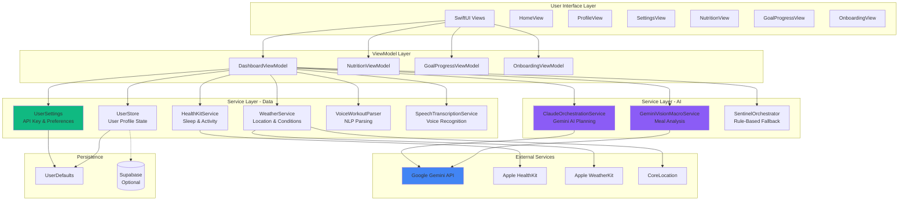
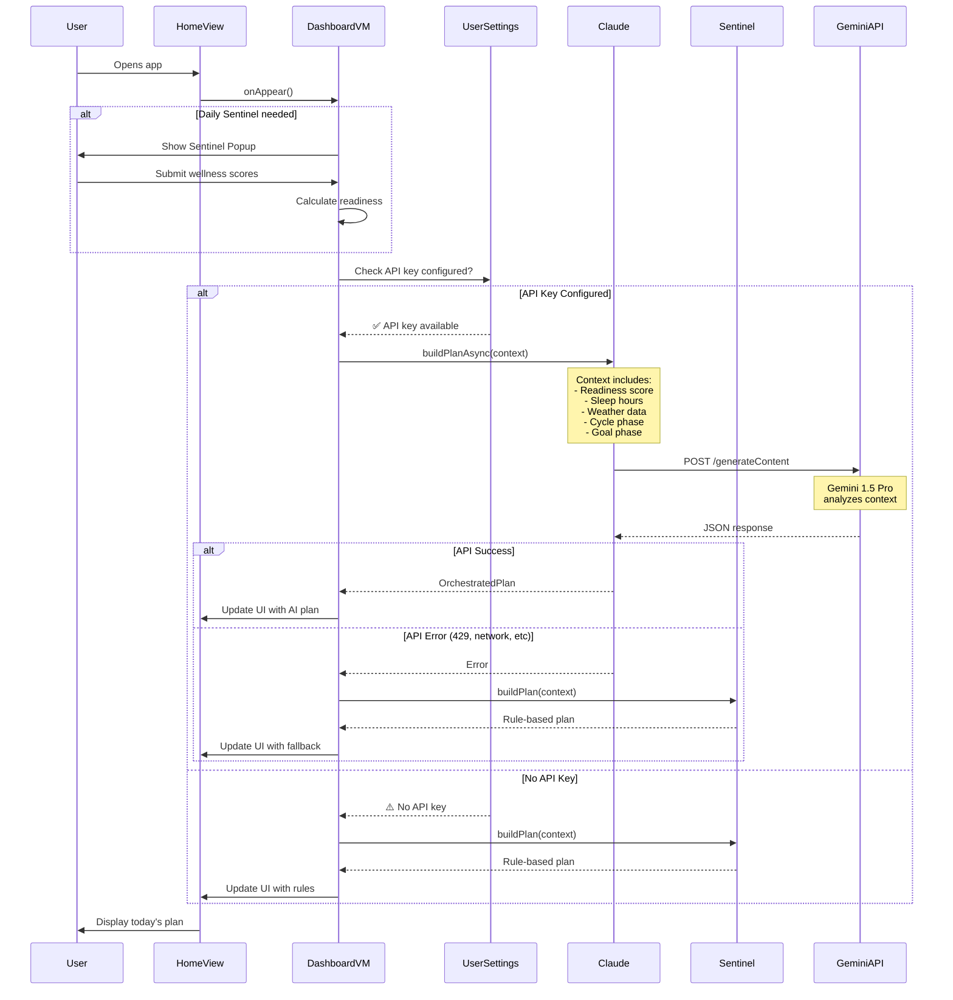
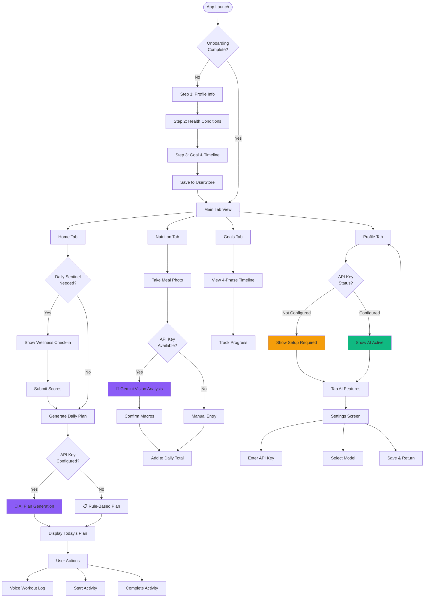
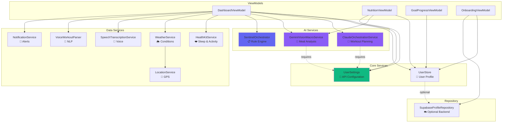
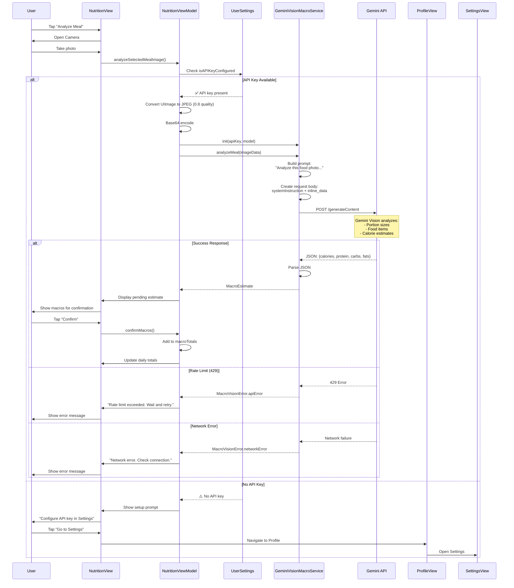
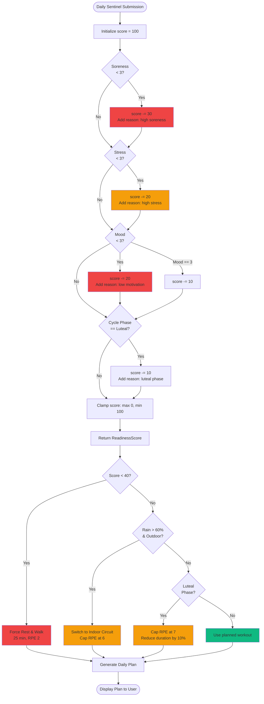
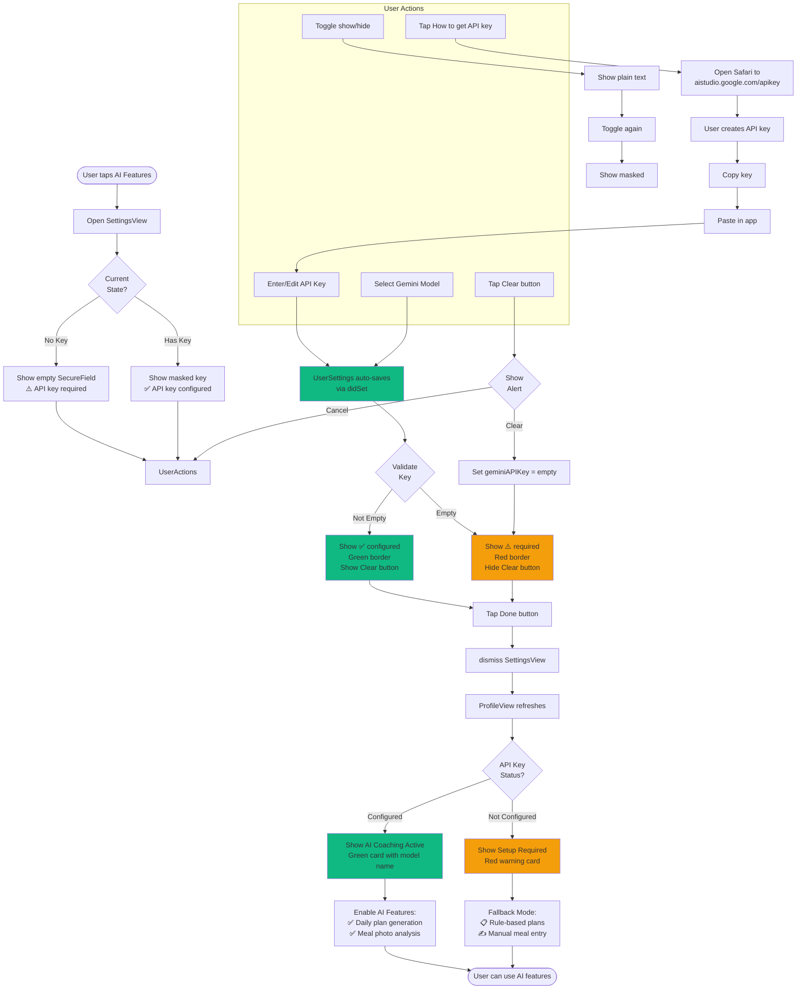
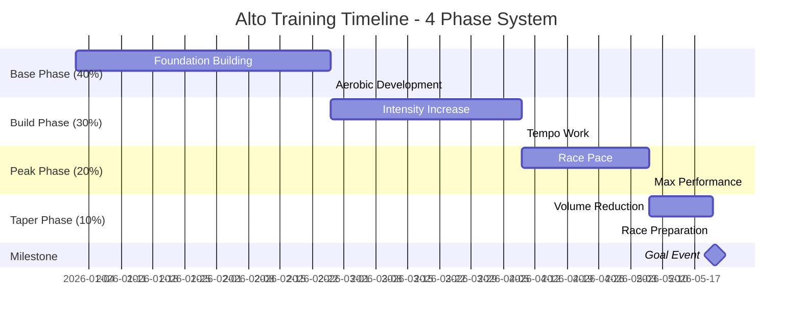
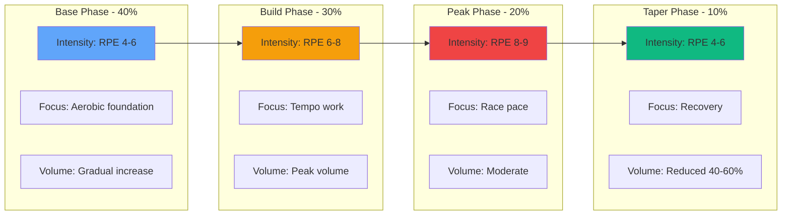
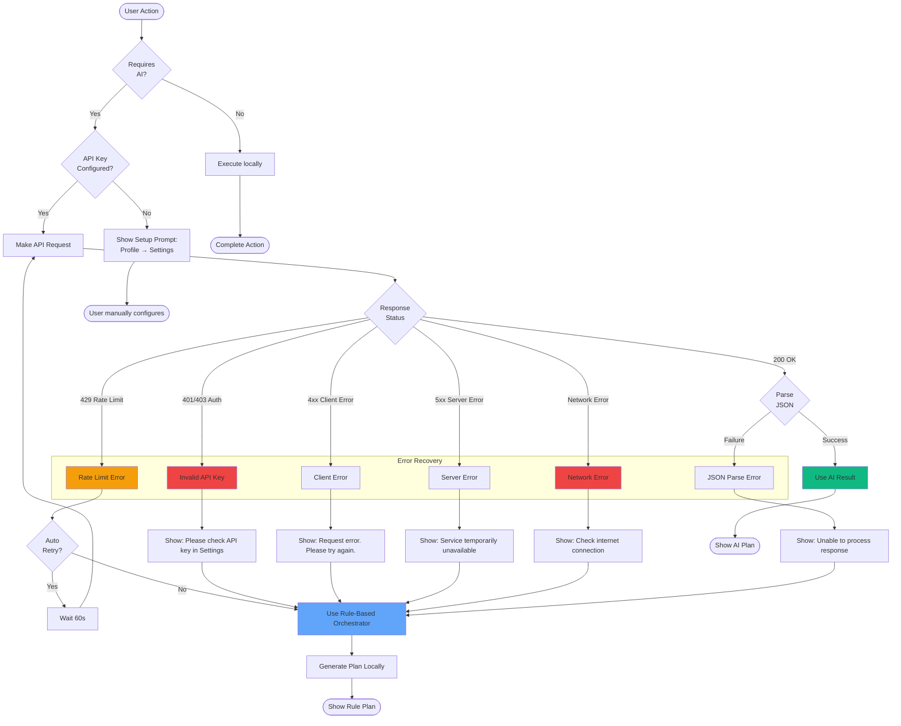

# Alto App - Architecture Diagrams

This document contains visual architecture diagrams for the Alto fitness app.

> **Note:** These diagrams use Mermaid syntax. View them on GitHub or use a Mermaid previewer for best results.

---

## 📊 Table of Contents

1. [System Architecture Overview](#1-system-architecture-overview)
2. [Component Diagram](#2-component-diagram)
3. [Data Flow - Daily Plan Generation](#3-data-flow---daily-plan-generation)
4. [API Integration Flow](#4-api-integration-flow)
5. [User Journey Flow](#5-user-journey-flow)
6. [Service Dependencies](#6-service-dependencies)
7. [State Management](#7-state-management)
8. [Meal Photo Analysis Flow](#8-meal-photo-analysis-flow)

---

## 1. System Architecture Overview



---

## 2. Component Diagram

```mermaid
graph LR
    subgraph "App Entry Point"
        AltoApp[AltoApp.swift<br/>@main]
    end

    subgraph "Global State"
        US[UserSettings<br/>@StateObject]
        Store[UserStore<br/>@StateObject]
        OnbVM[OnboardingViewModel<br/>@StateObject]
    end

    subgraph "Root Navigation"
        RootView[RootView<br/>Onboarding Router]
    end

    subgraph "Main App"
        MainTab[MainTabView<br/>4 Tabs]
        HomeTab[Home Tab]
        NutTab[Nutrition Tab]
        GoalsTab[Goals Tab]
        ProfTab[Profile Tab]
    end

    subgraph "Key Services"
        Claude[ClaudeOrchestrationService]
        Vision[GeminiVisionMacroService]
        Sentinel[SentinelOrchestrator]
    end

    AltoApp -->|inject| US
    AltoApp -->|inject| Store
    AltoApp -->|inject| OnbVM
    AltoApp --> RootView

    RootView -->|if complete| MainTab
    RootView -->|if not complete| Onboarding

    MainTab --> HomeTab
    MainTab --> NutTab
    MainTab --> GoalsTab
    MainTab --> ProfTab

    HomeTab -.->|uses| Claude
    HomeTab -.->|uses| Sentinel
    NutTab -.->|uses| Vision

    US -.->|provides API key| Claude
    US -.->|provides API key| Vision

    style US fill:#10B981
    style Claude fill:#8B5CF6
    style Vision fill:#8B5CF6
```

---

## 3. Data Flow - Daily Plan Generation



---

## 4. API Integration Flow

```mermaid
graph TB
    subgraph "User Configuration"
        User[User]
        SettingsUI[SettingsView]
        UserSettings[UserSettings Service]
    end

    subgraph "API Key Storage"
        UD[UserDefaults]
        Key[geminiAPIKey: String]
        Model[selectedGeminiModel: Enum]
    end

    subgraph "Service Initialization"
        ClaudeService[ClaudeOrchestrationService<br/>init apiKey, model]
        VisionService[GeminiVisionMacroService<br/>init apiKey, model]
    end

    subgraph "Gemini API"
        Endpoint1[/v1beta/models/gemini-1.5-pro:generateContent]
        Endpoint2[/v1beta/models/gemini-1.5-flash:generateContent]
    end

    subgraph "API Request"
        Headers[Headers:<br/>Content-Type: application/json]
        Body[Body:<br/>systemInstruction<br/>contents<br/>generationConfig]
        Params[URL Params:<br/>key=API_KEY]
    end

    subgraph "Response Handling"
        Success[200 OK<br/>Parse JSON]
        RateLimit[429 Rate Limit<br/>Fallback to Rules]
        Error[4xx/5xx Error<br/>Show user message]
    end

    User -->|1. Enter API key| SettingsUI
    SettingsUI -->|2. Save| UserSettings
    UserSettings -->|3. Persist| UD
    UserSettings -->|4. Store| Key
    UserSettings -->|4. Store| Model

    UserSettings -->|5. Provide credentials| ClaudeService
    UserSettings -->|5. Provide credentials| VisionService

    ClaudeService -->|6. HTTP POST| Endpoint1
    VisionService -->|6. HTTP POST| Endpoint2

    ClaudeService --> Headers
    ClaudeService --> Body
    ClaudeService --> Params

    Endpoint1 --> Success
    Endpoint1 --> RateLimit
    Endpoint1 --> Error

    style UserSettings fill:#10B981
    style ClaudeService fill:#8B5CF6
    style VisionService fill:#8B5CF6
    style Success fill:#10B981
    style RateLimit fill:#F59E0B
    style Error fill:#EF4444
```

---

## 5. User Journey Flow



---

## 6. Service Dependencies



---

## 7. State Management

```mermaid
graph LR
    subgraph "App Level State"
        AltoApp[@main AltoApp]
    end

    subgraph "Global StateObjects"
        US[UserSettings<br/>@StateObject]
        Store[UserStore<br/>@StateObject]
        OnbVM[OnboardingViewModel<br/>@StateObject]
    end

    subgraph "View Level State"
        HomeVM[DashboardViewModel<br/>@StateObject]
        NutVM[NutritionViewModel<br/>@StateObject]
        GoalVM[GoalProgressViewModel<br/>@StateObject]
    end

    subgraph "Persistence"
        UD1[UserDefaults<br/>geminiAPIKey]
        UD2[UserDefaults<br/>selectedGeminiModel]
        UD3[UserDefaults<br/>notificationsEnabled]
        UD4[UserDefaults<br/>user profile data]
    end

    subgraph "Published Properties"
        P1[@Published var geminiAPIKey]
        P2[@Published var todayPlan]
        P3[@Published var readinessScore]
        P4[@Published var macroTotals]
    end

    AltoApp -->|creates| US
    AltoApp -->|creates| Store
    AltoApp -->|creates| OnbVM

    AltoApp -->|.environmentObject| RootView
    RootView -->|inherits| HomeView
    RootView -->|inherits| NutritionView
    RootView -->|inherits| GoalsView
    RootView -->|inherits| ProfileView

    HomeView -->|creates| HomeVM
    NutritionView -->|creates| NutVM
    GoalsView -->|creates| GoalVM

    US --> P1
    HomeVM --> P2
    HomeVM --> P3
    NutVM --> P4

    P1 -->|auto-save| UD1
    US -->|saves to| UD2
    US -->|saves to| UD3
    Store -->|saves to| UD4

    style US fill:#10B981
    style P1 fill:#F59E0B
    style UD1 fill:#60A5FA
```

---

## 8. Meal Photo Analysis Flow



---

## 9. Readiness Scoring Algorithm



---

## 10. Voice Workout Logging Flow

```mermaid
stateDiagram-v2
    [*] --> Idle: HomeView loaded
    
    Idle --> Dictating: User taps "Dictate"
    Idle --> TextEntry: User types manually
    
    state Dictating {
        [*] --> RequestPermission
        RequestPermission --> CheckPermission: speechService.requestPermission()
        
        CheckPermission --> PermissionGranted: Allowed
        CheckPermission --> PermissionDenied: Denied
        
        PermissionGranted --> Recording: speechService.startTranscription()
        Recording --> Transcribing: Audio → Text
        Transcribing --> UpdateUI: voiceTranscript updates
        UpdateUI --> Recording: Continue listening
        
        PermissionDenied --> ShowError: Display permission error
        ShowError --> [*]
    end
    
    Dictating --> ReadyToParse: User taps "Stop"
    TextEntry --> ReadyToParse: Text entered
    
    state ReadyToParse {
        [*] --> Parse: User taps "Parse & Log"
        Parse --> VoiceParser: voiceParser.parse(transcript)
        
        VoiceParser --> RegexMatch: Pattern matching
        RegexMatch --> ExtractDuration: "30 mins"
        RegexMatch --> ExtractActivity: "yoga"
        
        ExtractDuration --> CreateEntry
        ExtractActivity --> CreateEntry
        
        CreateEntry --> Success: VoiceWorkoutEntry created
        CreateEntry --> Failure: Parse failed
        
        Success --> IncrementProgress: pathProgressSessions++
        Success --> ClearText: voiceTranscript = ""
        Success --> ShowConfirmation: "Logged: yoga · 30 min"
        
        Failure --> ShowError: "Could not parse. Try: I did 30 mins of yoga"
    end
    
    ReadyToParse --> Idle: Reset
    
    note right of Dictating
        Supported phrases:
        - "I did X mins of Y"
        - "Just finished X mins Y"
        - "Completed X mins of Y"
        - "X minutes of Y"
    end note
    
    note right of VoiceParser
        Extracts:
        - Duration (number + unit)
        - Activity type
        - Creates structured entry
    end note
```

---

## 11. Settings Configuration Flow



---

## 12. Four-Phase Training Timeline



**Phase Characteristics:**



---

## 13. Error Handling Strategy



---

## How to Use These Diagrams

### Viewing on GitHub
GitHub automatically renders Mermaid diagrams. Just view this file on GitHub!

### Viewing Locally
1. **VS Code:** Install "Markdown Preview Mermaid Support" extension
2. **IntelliJ/WebStorm:** Built-in Mermaid support
3. **Browser:** Use [Mermaid Live Editor](https://mermaid.live/)

### Exporting
```bash
# Install Mermaid CLI
npm install -g @mermaid-js/mermaid-cli

# Export as PNG
mmdc -i ARCHITECTURE_DIAGRAMS.md -o diagrams/
```

---

## Legend

**Color Coding:**
- 🟢 Green (#10B981) - Success states, configured items
- 🟣 Purple (#8B5CF6) - AI services, Gemini-powered features
- 🔵 Blue (#60A5FA) - Data services, storage
- 🟡 Yellow (#F59E0B) - Warning states, fallback modes
- 🔴 Red (#EF4444) - Error states, required actions

**Shapes:**
- Rectangle - Process/Component
- Diamond - Decision point
- Circle - Start/End point
- Hexagon - External service
- Cylinder - Database/Storage

---

**Last Updated:** April 2026  
**Version:** 1.0.0  
**Maintained by:** Alto Development Team
